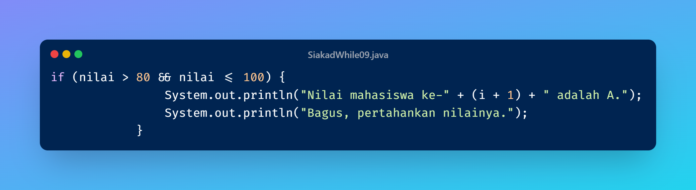
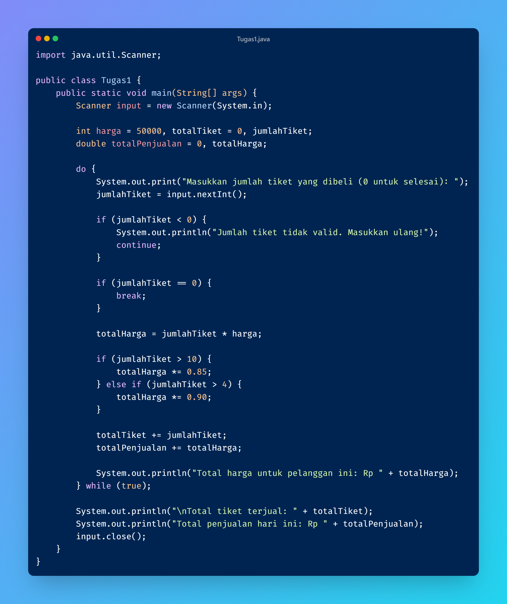
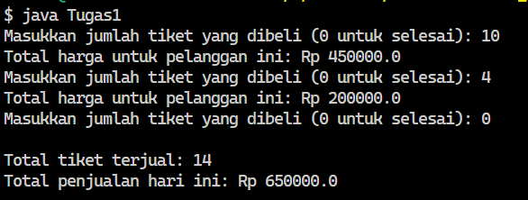
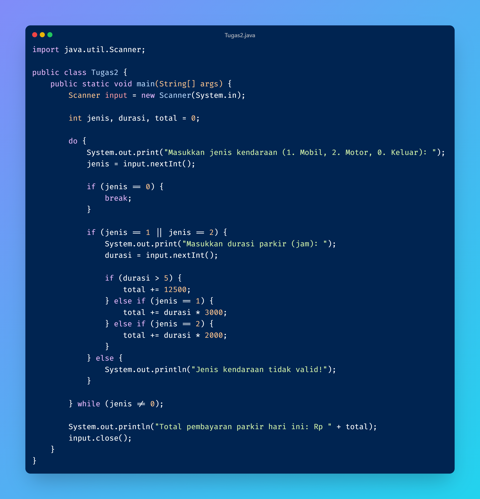
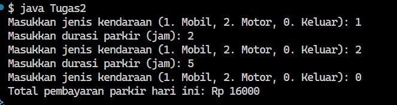

**Pertanyaan 2.1.3**
1. Sebutkan dan tunjukkan masing-masing komponen perulangan FOR pada kode program Percobaan 1!
- inisialisasi | int i = 1;, kondisi |  i <= 10; , dan perubahan nilai (increment/decrement) | i++

2. Mengapa variabel tertinggi diinisialisasi 0 dan terendah diinisialisasi 100? Apa yang terjadi jika variabel tertinggi diinisialisasi 100 dan terendah diinisialisasi 0?
- tertinggi = 0 Karena nilai mahasiswa biasanya berada antara 0–100, maka semua nilai yang dimasukkan pasti lebih besar dari 0. terendah = 100 Karena semua nilai pasti lebih kecil atau sama dengan 100, nilai pertama pasti lebih kecil dari 100. Jika dibalik maka hasil akhir tertinggi akan selalu 100 dan hasil akhir terendah akan selalu 0.

3. Jelaskan fungsi dan alur kerja dari potongan kode berikut!
- Fungsi kode tersebut untuk mencari nilai tertinggi dan terendah dari beberapa input.

4. Modifikasi kode program sehingga terdapat perhitungan untuk menentukan berapa mahasiswa yang lulus dan yang tidak lulus berdasarkan batas kelulusan (nilai minimal 60). Tampilkan jumlah mahasiswa lulus dan tidak lulus setelah menampilkan nilai tertinggi dan terendah!
-  

**Pertanyaan 2.2.3**
1. Pada potongan kode berikut, tentukan maksud dan kegunaan dari sintaks berikut:
a. nilai < 0 || nilai > 100
b. continue
- a. Untuk mengecek nilai kurang dari 0 atau nilai lebih dari 100
- b. Untuk jika nilai tidak valid, program menampilkan pesan lalu meminta input berikutnya tanpa memproses nilai itu lebih lanjut.

2. Mengapa sintaks i++ dituliskan di akhir perulangan WHILE? Apa yang terjadi jika posisinya dituliskan di awal perulangan WHILE?
- Jika i++ ditulis di akhir program akan memproses data untuk nilai i sekarang lalu menambah 1 setelah selesai, jika i++ ditulis di awal perulangan, maka i akan langsung menambah sebelum digunakan akibatnya data pertama akan terlewat.

3. Apabila jumlah mahasiswa yang dimasukkan adalah 19, berapa kali perulangan WHILE akan berjalan?
- 19 kali sesuai jumlah input.

4. Modifikasi kode program sehingga apabila terdapat mahasiswa yang mendapat nilai A, program menampilkan pesan tambahan "Bagus, pertahankan nilainya"!
- 

**Pertanyaan 2.3.3**
1. Pada penggunaan DO-WHILE ini, apabila nama pelanggan yang dimasukkan pertama kali adalah “batal”, maka berapa kali perulangan dilakukan?
- Tidak akan ada perulangan karena jika batal langsung keluar dari perulangan.

2. Sebutkan kondisi berhenti yang digunakan pada perulangan DO-WHILE tersebut!
- Kondisi berhenti yaitu break pada if {}.

3. Apa fungsi dari penggunaan nilai true pada kondisi DO-WHILE?
- Sebagai nilai perulangan jika true akan melakukan perulangan jika false maka akan berhenti. 

4. Mengapa perulangan DO-WHILE tersebut tetap berjalan meskipun tidak ada komponen inisialisasi dan update?
- Karena kondisi pada while bernilai true yang berarti kondisi perulangan selalu terpenuhi dan hanya bisa berhenti jika ada perintah break saat menginputkan batal.

/*TUGAS 5*/

1. 
   

2. 
   