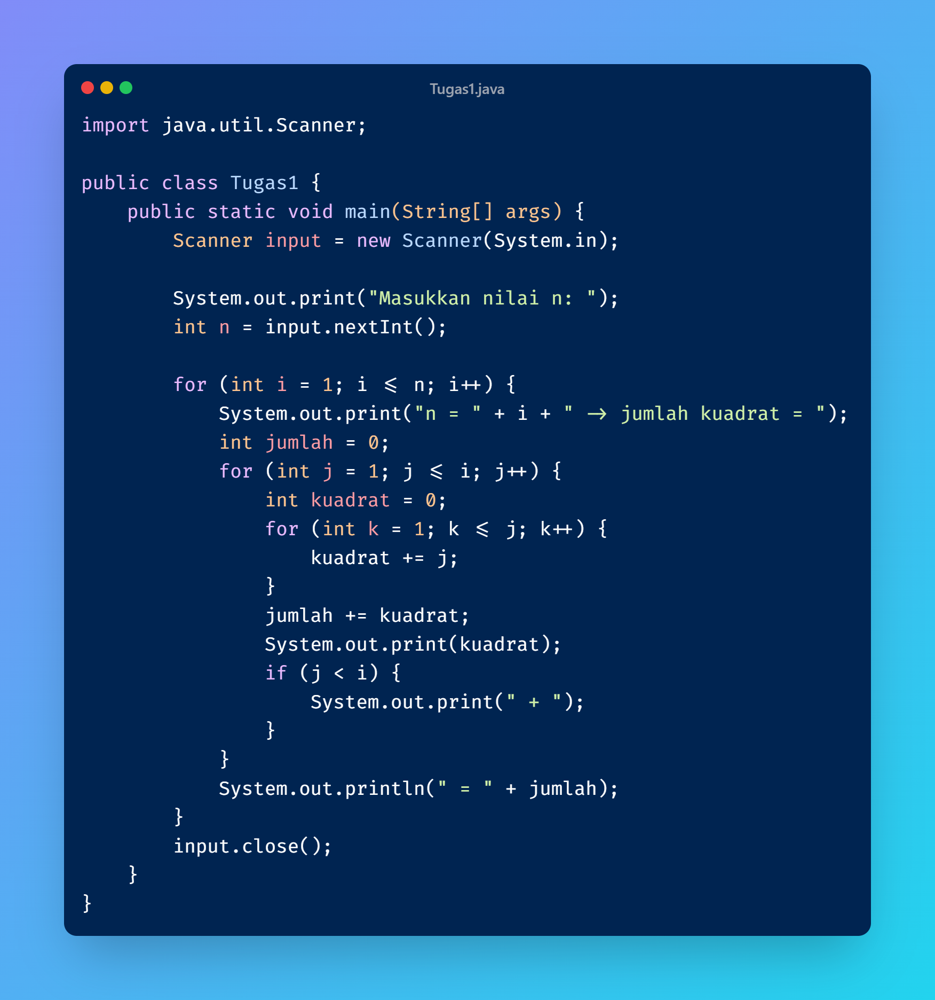
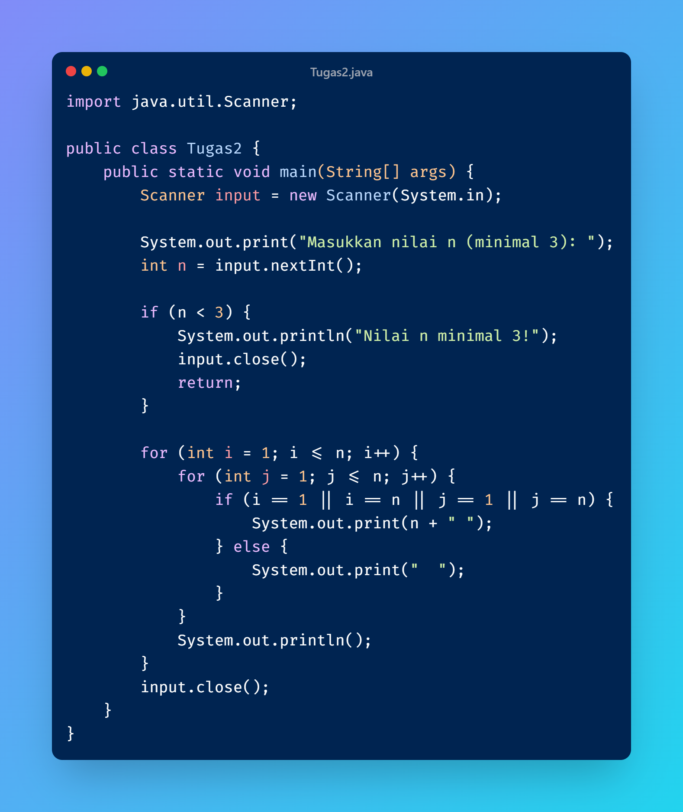
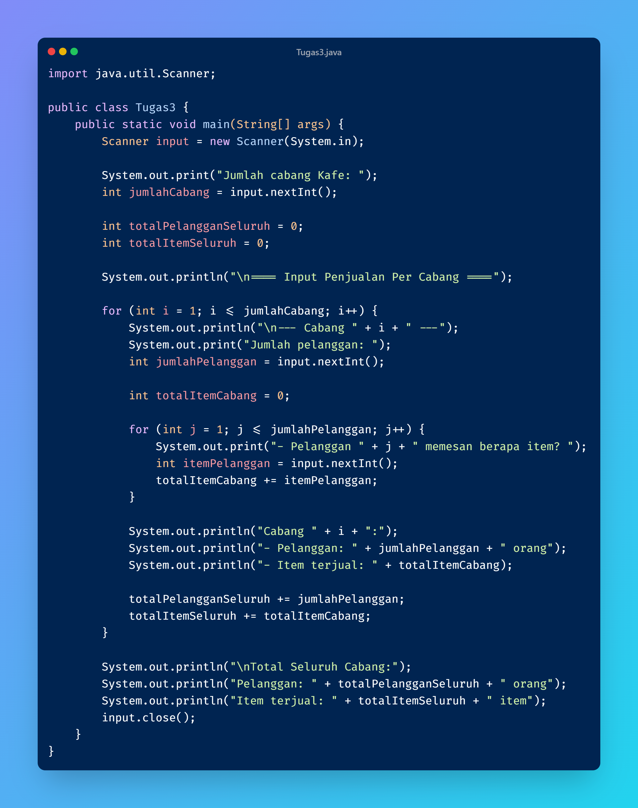

**Pertanyaan 2.1**
1. Jika pada perulangan for, inisialisasi i=1 diubah menjadi i=0, apa akibatnya? Mengapa bisa demikian? 
- Jika diubah menjadi i = 0 maka akan berlebih 1 bintang sehingga jika n diinput 5 maka akan membuat 6 bintang.

2. Jika pada perulangan for, kondisi i<=n diubah menjadi i<n, bagaimana bentuk outputnya jika input 
n = 5? Mengapa hasilnya berbeda? 
- Output akan 5 bintang karena sebelumnya sudah diubah pada i = 0.

3. Jika pada perulangan for, kondisi i <= n diubah menjadi i > n, apa akibatnya? Mengapa bisa demikian?
- Tidak akan ada output karena kondisinya salah.

4. Jika pada perulangan for, kondisi step i++ diubah menjadi i-- apa akibatnya? Mengapa bisa demikian? 
- Akan infinite loop karena nilai i terus berkurang dan tidak pernah mencapai i <= n.

5. Jika pada perulangan for, step i++ diubah menjadi i += 2, bagaimana pola outputnya jika input n = 6? Apa yang menyebabkan perubahan tersebut?
- Akan dibuat 3 bintang karena i bertambah 2 setiap langkah karena langkah lebih besar jumlah bintang lebih sedikit.

**Pertanyaan 2.2**
1. Perhatikan perulangan luar. Jika pada sintaks for, inisialisasi iOuter=1 diubah menjadi iOuter=0, apa yang akibatnya? Mengapa bisa demikian?
- Kolom bintang akan berlebih 1 jika n diinput 5 maka akan menjadi 6 karena inisialisasi dimulai dari 0.

2. Kembalikan program semula dimana inisialisasi iOuter=1. Kemudian perhatikan perulangan dalam. Jika pada sintaks for, inisialisasi i=1 diubah menjadi i=0, apa yang akibatnya? Mengapa bisa demikian?
- Setiap baris akan berlebih 1 bintang jika n diinput 5 maka setiap baris akan berisi 6 bintang karea perulangan yang di dalam dimulai dari 0.

3. Apakah perbedaan kegunaan antara perulangan luar dengan perulangan yang berada di dalamnya?
- Perulangan luar untuk mengatur kolom dan yang dalam untuk mengatur baris.

4. Mengapa perlu ditambahkan sintaks System.out.println(); di bawah perulangan dalam? Apa akibatnya jika sintaks tersebut dihilangkan?
- Untuk pindah baris baru ketika bintang sudah mencapai batas jika dihilangkan maka bintang akan jadi satu baris panjang.

5. Silakan commit dan push ke repository Anda.
- OK

**Pertanyaan 2.3**
1. Perhatikan, apakah output yang dihasilkan dengan nilai n = 5 sesuai dengan tampilan berikut?
- Tidak sesuai

2. Jika tidak sesuai, bagian mana saja yang harus diperbaiki/ditambahkan? Jelaskan setiap bagian yang perlu diperbaiki/ditambahkan.
- Pada perulangan luar ditambahkan "System.out.println();" setelah i++  agar berpindah baris dan pada kondisi while dalam diubah menjadi "(j <= i)".

3. Silakan commit dan push ke repository Anda.
-   OK

4. Jelaskan peran masing-masing variabel i dan j dalam program ini. Mengapa j di-set ulang ke 0 di awal setiap iterasi outer loop? Apa yang akan terjadi jika j tidak di-reset?
- Variabel i berperan untuk baris perulangan luar yang menentukan baris keberapa yang dicetak dan variabel j berperan untuk berapa banyak bintang dicetak. 
- j diset ke 0 karena setiap baris baru bintang akan dicetak dari awal.
- Jika j tidak direset maka akan menyimpan nilai terakhir yang mengakibatkan bintang tidak tercetak jika pindah baris.

**Pertanyaan 2.4**
1. Jelaskan apa yang terjadi pada variabel totalNilai di setiap iterasi outer loop dan mengapa inisialisasinya (total = 0) berada di dalam outer loop, bukan di luar.
- Variabel totalNilai untuk menjumlahkan nilai dari lima penilai pada satu kelompok. Nilainya harus direset dari 0 karena setiap kelompok memiliki perhitungan berbeda. 
- Jika inisialisasi totalNilai = 0 diletakkan di luar, maka nilainya akan terus bertambah dari kelompok sebelumnya sehingga hasil rata-rata tiap kelompok menjadi salah.

2. Modifikasi program di atas, sehingga dapat mencari kelompok dengan rata-rata nilai tertinggi dan tampilkan nomor kelompok tersebut.
- 

/*TUGAS 6*/
1. 

2. 

3. 