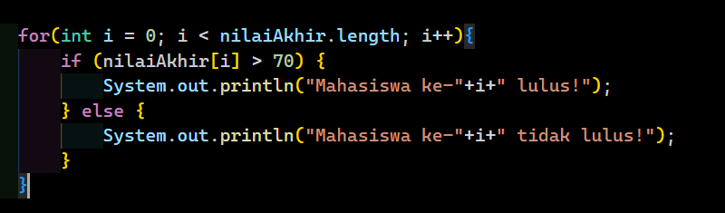
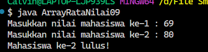
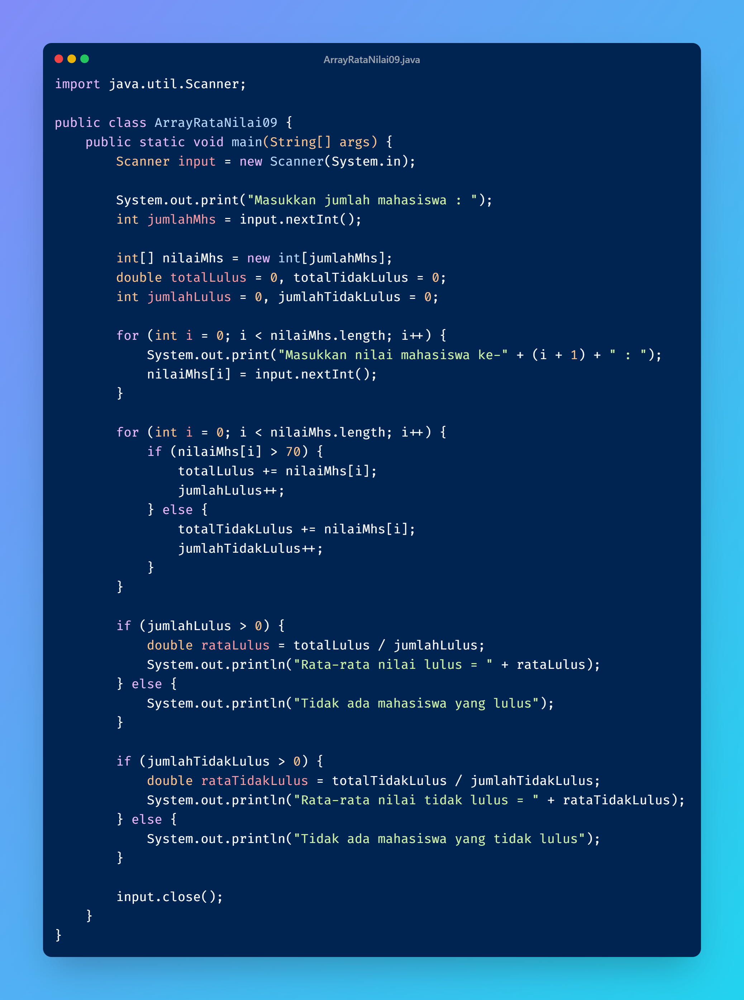
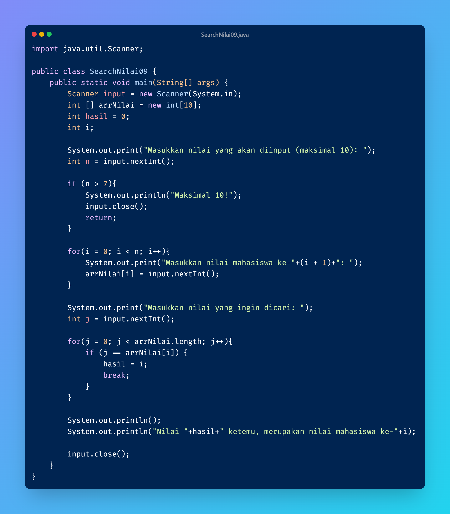

**Pertanyaan 2.1**
1. Jika isi masing-masing elemen array bil diubah dengan angka 5.0, 12867, 7.5, 2000000. Apa yang terjadi? Mengapa bisa demikian?
- Karena array harus memiliki tipe data yang sama, pada pertanyaan ada tipe data double yang menyebabkan error.

2. Modifikasi kode program di atas dengan melakukan inisialisasi elemen array sekaligus pada saat deklarasi array.
- 

3. Ubah statement pada langkah No 4 menjadi seperti berikut. Apa keluaran dari program? Jelaskan maksud dari statement tersebut.
- Output sama seperti sebelumnya hanya saja lebih ringkas karena menggunakan perulangan.

4. Jika kondisi pada statement for-loop di atas diubah menjadi: i <= 4, apa keluaran dari program? Mengapa demikian?
- Akan terjadi error "Index 4 out of bounds for length 4" karena pada array dimulai dari 0 sehingga jika array diisi 4 nilai index maksimalnya adalah 3.

**Pertanyaan 2.2**
1. Ubah statement pada langkah nomor 5 menjadi seperti berikut ini: Jalankan program. Apakah terjadi perubahan? Mengapa demikian?
- Tidak ada perubahan karena length merupakan panjang dari array yaitu 10 sama seperti kondisi awal yaitu "i < 10"

2. Apa yang dimaksud dengan kondisi: i < nilaiAkhir.length ?
- i lebih kecil dari panjang array.

3. Ubah statement pada langkah nomor 6 menjadi seperti berikut ini, sehingga program hanya menampilkan nilai Mahasiswa yang lulus saja (yaitu mahasiswa yang memiliki nilai > 70): Jalankan program dan jelaskan alur program!
- Nilai yang diinput akan tersimpan pada array, lalu nilai akan dicek pada if jika nilai pada array lebih dari 70 maka akan muncul pesan lulus.

4. Modifikasi program agar menampilkan status kelulusan semua mahasiswa berdasarkan nilai, yaitu dengan menampilkan status mana mahasiswa yang lulus dan tidak lulus, seperti ilustrasi output berikut:
- 

**Pertanyaan 2.3**
1. Modifikasi kode program pada praktikum percobaan 3 di atas (ArrayRataNilaiXX.java) agar program dapat menampilkan banyaknya mahasiswa yang lulus, yaitu mahasiswa yang memiliki lebih besar dari 70 (>70).
- 

2. Modifikasi program pada praktikum percobaan 3 di atas (ArrayRataNilaiXX.java) sehingga program menerima jumlah elemen berdasarkan input dari pengguna dan mengeluarkan output seperti berikut ini:
- 

**Pertanyaan 2.4**
1. Jelaskan maksud dari statement break; pada baris ke-10 kode program percobaan 4 di atas.
- Untuk keluar dari looping jika kondisi sudah terpenuhi.

2. Modifikasi kode program pada percobaan 4 di atas sehingga program dapat menerima input berupa banyaknya elemen array nilai, isi array, dan sebuah nilai (key) yang ingin dicari. Lalu cetak ke layar indeks posisi elemen dari nilai (key) yang dicari. Contoh hasil program:
- 

3. Modifikasi program pada percobaan 4 di atas, sehingga program akan memberikan pesan "Nilai yang dicari tidak ditemukan" jika nilai yang dicari (key) tidak ada di dalam array. Contoh tampilan program sebagai berikut:
- .png)

/*TUGAS 7*/
1..png)

2..png)

3..png)