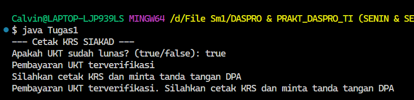
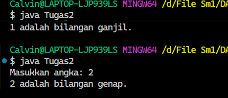
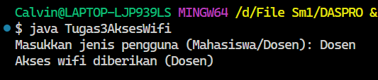
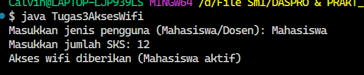
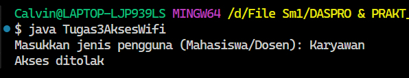

**Pertanyaan 2.1**
1. Mengapa pengecekan pada struktur IF tersebut tidak melibatkan kondisi dengan
operator relasional?
- Karena uktLunas menggunakan tipe data Boolean sehingga tidak perlu melibatkan operator relasional.
  
2. Saat program dijalankan, kemudian Anda mengisikan nilai false, bagaimana hasilnya?
- Tidak akan muncul apapun karena pada code hanya if saja tidak ada else.

**Pertanyaan 2.2**
1. Apa fungsi dari sintaks break?
- Untuk menghentikan perulangan.

2. Apa peran dari sintaks default pada struktur pemilihan SWITCH-CASE?
- Berperan sebagai hasil akhir jika tidak ada nilai case yang cocok.

**Pertanyaan 2.3**
1. Apa yang terjadi jika mahasiswa menjawab "No" pada pertanyaan bebas kompen?
Mengapa demikian?
- Maka akan muncul mahasiswa masih ada tanggungan kompen, karena kondisi if terluar bernilai false.

2. Jelaskan maksud dari potongan kode berikut!  if (bimbinganP1 >= 8 && bimbinganP2 >= 4)
- Berfungsi untuk memeriksa apakah mahasiswa telah memenuhi semua persyaratan minimum log bimbingan untuk mendaftar skripsi.

3. Bagaimana alur pemeriksaan syarat mahasiswa dari awal sampai akhir? Jelaskan secara
runtut untuk semua kondisi!
- Program memeriksa apakah mahasiswa sudah bebas kompensasi.
- Jika jawabannya "Tidak", langsung ditolak dengan pesan gagal.
- Jika "Ya", program lanjut memeriksa jumlah log bimbingan.
- Jika bimbingan P1 ≥ 8 dan P2 ≥ 4, mahasiswa dinyatakan boleh mendaftar ujian skripsi.
- Jika keduanya kurang dari syarat, muncul pesan gagal untuk keduanya.
- Jika hanya P1 yang kurang, muncul pesan gagal untuk P1.
- Jika hanya P2 yang kurang, muncul pesan gagal untuk P2.

/*TUGAS 4*/

1. 

2. 

3. 

 
 